# CryptoQuant Data Platform Assignment(데이터 플랫폼 과제)

CryptoQuant Data Platform Engineer(데이터 플랫폼 엔지니어) 사전과제 제출용 저장소입니다. 실행 코드, 설계 근거, 검증 증거, AI 활용 및 인간 검증 요약을 과제 제출 범위에 맞춰 보관합니다.

## 과제 범위

| 과제 | 범위 | 현재 성격 |
|---|---|---|
| Task 1(과제 1) | Bitcoin Network Velocity pipeline design(비트코인 네트워크 회전율 파이프라인 설계) | 데이터 제품 설계 문서이며, 실행 파이프라인 구현물은 아닙니다. |
| Task 2(과제 2) | Ethereum log ingestion implementation(이더리움 로그 수집 구현) | JSON-RPC(제이슨 원격 프로시저 호출), Airflow DAG(작업 흐름 정의), Delta Lake(델타 레이크), DuckDB(덕디비), dbt(데이터 빌드 도구), pytest fixture(파이테스트 고정 테스트 데이터) 기반 구현 |

## 구현 상태

| 영역 | 상태 | 근거 또는 제한 |
|---|---|---|
| Task 1 metric(과제 1 지표) | 설계 문서화 | [Task 1 README(과제 1 안내)](./docs/task_01_bitcoin_velocity/00_task_01_index.md), [metric definition(지표 정의)](./docs/task_01_bitcoin_velocity/02_velocity_metric_definition.md) |
| Task 2 Python modules(과제 2 Python 모듈) | 구현되었습니다. | `src/cryptoquant_pipeline/`. 삭제된 `src/eth_pipeline/`와 `src/cryptoquant_assignment/`는 레거시 구현 |
| Task 2 tests/fixtures(과제 2 테스트와 고정 테스트 데이터) | Fixture(고정 테스트 데이터) 검증되었습니다. | `tests/test_*`, `scripts/create_dbt_validation_fixture.py` |
| Delta/dbt local path(Delta Lake와 dbt 로컬 경로) | 구현되었습니다. | `dbt/`, `src/cryptoquant_pipeline/delta_writer.py` |
| Airflow DAG(작업 흐름 정의) | 구현되었습니다. | `airflow/dags/ethereum_hourly_logs.py` |
| Refactoring/document consistency(리팩토링 및 문서 정합성) | 갱신되었습니다. | [refactoring report](./docs/10_refactoring_report.md), [documentation consistency report](./docs/11_documentation_consistency_report.md) |
| Real Ethereum RPC(실제 Ethereum 원격 프로시저 호출) | 검증되었습니다. | `airflow/logs/` 기준 successful scheduled run 반환값 33건과 v2 산출물 direct inspection을 확인. 최신 direct count는 `data/delta/ethereum_logs_v2` 6,848,937건, `erc20_transfers` 6,079,379건. production SLA와 full-history backfill은 별도 검증 대상 |
| Airflow UI 실행 이력 | 검증되었습니다. | `data/imgs/`의 Airflow screenshot에서 `ethereum_hourly_logs` 등록, `@hourly`, success 47, failed 14 이력을 확인. UI metadata는 task log와 Delta/DuckDB 산출물과 함께 해석 |
| Airflow/Docker graph 검증 | 로컬 graph를 검증했습니다. | pytest, ruff, Airflow DagBag import, fixture 기반 dbt build 결과는 [validation evidence(검증 증거)](./docs/05_validation_evidence.md)에 기록 |
| Accumulated local data freshness(누적 로컬 데이터 최신성) | 부분 검증되었습니다. | notebook 04가 최신 v2 pair를 자동 선택해 raw 6,848,937건, 중복 0, 최신 schema를 확인. 다만 2026-06-22 12:00 UTC hourly gap 1개와 DuckDB staging view 절대경로 문제 때문에 `PARTIALLY VERIFIED` |
| Reorg canonical replacement(체인 재편성 이후 정본 교체) | Design-only(설계 전용) / future hardening(향후 보강) | 현재 구현은 finality buffer(확정성 완충 구간)와 idempotent append(멱등 추가 적재) 중심 |

## 완료 계층

| 계층 | 현재 판정 | 근거 | 한계 |
|---|---|---|---|
| CORE FUNCTIONAL READY | VERIFIED | 과제 2 직접 요구사항은 Airflow DAG, `eth_getLogs`, logical interval, block range, retry, idempotency, Delta, dbt 필수 모델, Treasury flow 기준으로 코드와 테스트에 연결됨 | canonical reorg replacement는 직접 구현 범위가 아니라 future hardening으로 분리 |
| SUBMISSION RELEASE READY | PARTIALLY VERIFIED | README, 실행 가이드, validation evidence, AI 활용 요약, secret hygiene, Docker 기반 실행 증거 존재 | 최종 main 커밋과 remote 반영 여부는 Git metadata 확인이 필요합니다. Collaborator 초대는 사용자 확인 기준으로 반영했습니다. |
| BONUS READY | VERIFIED | `tag:ethereum_hourly` selector와 dbt `ref()` graph로 `tether_treasury_flow_quality_summary`가 DAG 수정 없이 `dbt build` 범위에 포함됩니다. | Airflow dynamic task mapping은 구현하지 않았습니다. |
| LEGACY CLEANUP | PARTIALLY VERIFIED | canonical 경로는 `src/cryptoquant_pipeline/`, `airflow/dags/ethereum_hourly_logs.py`, `dbt/models/`로 정리됨 | historical/exploratory 문서는 제출 판단에서 제외 |

## 저장소 안내

| 구분 | 위치 | 용도 |
|---|---|---|
| Core Submission Material(핵심 제출 자료) | [README.md](./README.md), [docs/00_documentation_index.md](./docs/00_documentation_index.md), [docs/07_submission_readiness_report.md](./docs/07_submission_readiness_report.md) | 제출 범위, 현재 상태, 리스크, 검증 경계 |
| Task 1 Documentation(과제 1 문서) | [docs/task_01_bitcoin_velocity/](./docs/task_01_bitcoin_velocity/) | Bitcoin Velocity(비트코인 회전율) 데이터 제품 설계 |
| Task 2 Source of Truth(과제 2 현재 기준 구현과 문서) | `src/cryptoquant_pipeline/`, `airflow/dags/ethereum_hourly_logs.py`, `dbt/models/`, [docs/02_data_contracts.md](./docs/02_data_contracts.md), [docs/03_execution_guide.md](./docs/03_execution_guide.md), [docs/04_failure_retry_backfill_strategy.md](./docs/04_failure_retry_backfill_strategy.md) | 현재 구현과 실행 방식 |
| Validation Evidence(검증 증거) | [docs/05_validation_evidence.md](./docs/05_validation_evidence.md), [docs/07_submission_readiness_report.md](./docs/07_submission_readiness_report.md), [docs/09_requirement_traceability_matrix.md](./docs/09_requirement_traceability_matrix.md), `tests/`, `src/notebooks/`, `data/imgs/` | 실행한 검증, 노트북 검증 보조 증거, Airflow UI screenshot evidence, 검증되지 않은 범위 |
| AI Usage Transparency(AI 활용 투명성) | [docs/08_ai_usage_transparency_and_validation.md](./docs/08_ai_usage_transparency_and_validation.md) | PDF 결과 보고서 제출 요구에 맞춘 AI 사용 목적, 대표 프롬프트 원문형 요약, 인간 검증 방식 |
| Generated / Excluded Material(생성 산출물 및 제출 제외 자료) | `.venv/`, `__pycache__/`, `.pytest_cache/`, `.ruff_cache/`, `airflow/logs/`, `data/delta/`, `data/analytics/`, `data/duckdb_extensions/`, `dbt/target/`, `dbt/logs/` | 로컬 실행 산출물이며, 제출 기준 자료는 아닙니다. |

## 과제 1 범위 경계

이 지표는 policy-defined gross on-chain output velocity indicator(정책으로 정의한 총 온체인 출력 회전율 지표)입니다. Economic transaction volume(경제적 거래량), exchange spot trading volume(거래소 현물 거래량), price direction(가격 방향)을 직접 측정하지 않습니다.

이 과제는 CryptoQuant production metrics(실제 운영 지표)를 재현한다고 주장하지 않습니다. 공개 제품 설명은 Contextual reference(맥락 참고 자료)로만 사용합니다.

CryptoQuant 공개 지표 설명은 참고 배경입니다. 자세한 proprietary estimation method(비공개 추정 방식)와 production data contract(운영 데이터 계약)가 제공되지 않았기 때문에, 이 저장소는 투명한 정책과 가정된 원천 테이블을 사용해 assignment-scoped V1 metric(과제 범위 V1 지표)을 별도로 정의합니다.

Task 1 V1(과제 1 V1)은 다음과 같습니다.

```text
assignment_velocity_365d_policy_eligible_utxo_v1
= trailing 365-day gross on-chain output volume from regular Bitcoin transactions
/ policy-eligible UTXO supply at the day-end cutoff
```

주요 제한:

- `tx_output`에는 recipient payment(수신자 지급분)와 change output(거스름돈 출력)이 함께 들어갈 수 있어 wallet reshuffling(지갑 재정렬), exchange wallet management(거래소 지갑 관리), change output(거스름돈 출력)이 gross output volume(총 출력 이동량)을 키울 수 있습니다.
- Exchange-internal spot trade(거래소 내부 현물 거래)는 거래소 내부 장부에서만 발생할 수 있으므로 온체인 데이터에 나타나지 않을 수 있습니다.
- Dormant UTXO(장기 미사용 UTXO)는 장기 미사용 상태일 뿐 lost coins(분실 코인)로 자동 분류하지 않습니다.
- Coinbase transaction(코인베이스 트랜잭션)은 일반 BTC transfer activity(비트코인 전송 활동)로 취급하지 않습니다.
- Provably unspendable output(기술적으로 지출할 수 없다고 증명되는 출력)은 protocol/script(프로토콜/스크립트) 수준에서 식별 가능한 경우에만 제외합니다.
- 이 지표는 다른 on-chain indicators(온체인 지표)와 함께 해석해야 하며 market prediction tool(시장 예측 도구)가 아닙니다.

## 과제 2 범위 경계

Task 2(과제 2)는 Ethereum(이더리움) `eth_getLogs`로 event logs(이벤트 로그)를 수집하고, ERC-20 Transfer(ERC-20 전송 이벤트) 및 externally sourced Tether Treasury-labelled address flow(외부 출처의 Tether Treasury 라벨 주소 흐름)를 Fixture(고정 테스트 데이터)와 로컬 도구로 검증하는 구현입니다.

주요 제한:

- Fixture-based validation(고정 테스트 데이터 기반 검증)은 Mainnet validation(메인넷 검증)과 같지 않습니다.
- Real RPC execution(실제 원격 프로시저 호출 실행)에는 `ETH_RPC_URL`이 필요합니다.
- Full End-to-End Airflow/Docker validation(전체 경로 Airflow/Docker 검증)은 Airflow task log, Delta/DuckDB 산출물, notebook 또는 test 증거가 함께 있는 범위에서만 주장합니다.
- 현재 Reorg(체인 재편성) 지원은 finality buffer(확정성 완충 구간)와 idempotent replay(멱등 재실행)로 제한됩니다. Block-hash checkpoints(블록 해시 체크포인트) 기반 canonical replacement(정본 교체)는 구현하지 않았습니다.
- Address entity labels(주소 엔티티 라벨)는 외부 설정이며 protocol truth(프로토콜 수준의 사실)가 아닙니다.
- 원본 `uint256` hex(16진수 값)는 보존합니다. DuckDB/dbt decimal conversion(십진수 변환)은 의도적으로 제한되어 있으며, 큰 값은 이후 정확한 처리를 위해 numeric fields(숫자 필드)에 `null`로 남을 수 있습니다.

## Task 2 Ethereum Hourly Pipeline

```mermaid
flowchart LR
    A["Airflow @hourly data_interval"] --> B["pipeline.run_interval(start, end)"]
    B --> C["eth_getBlockByNumber(finalized)"]
    C --> D["timestamp -> block lower-bound binary search"]
    D --> E["Transfer topic0 eth_getLogs chunks <= 10 blocks"]
    E --> F["Raw log normalization"]
    F --> G["Delta insert-if-not-exists by natural key"]
    G --> H["dbt build --select tag:ethereum_hourly --vars window"]
    H --> I["erc20_transfers"]
    I --> J["tether_treasury_flow"]
    J --> K["tether_treasury_flow_quality_summary"]
```



핵심 실행 경계:

- Provider abstraction: `ETH_RPC_AUTH_MODE=none|basic|bearer`. Alchemy Free는 `none` 가능. 기존 `CHAINSTACK_*` 환경 변수는 fallback으로만 읽습니다.
- Alchemy Free 불변식: `MAX_BLOCKS_PER_LOG_REQUEST = 10`, `chunk_end = min(chunk_start + 9, to_block)`.
- collection scope: 기본 acceptance path는 `transfer_topic_all_addresses`입니다. `address/from/to` filter 없이 `Transfer(address,address,uint256)` `topic0`만 사용하며, run 중 scope를 축소하지 않습니다.
- 속도 제한: 기본 `ETH_RPC_REQUESTS_PER_SECOND=4`, `ETH_RPC_CONCURRENCY=1`.
- 시간 규칙: 모든 interval은 UTC `[window_start, window_end)` half-open입니다. `now() - 1h` 방식, latest block offset 방식은 사용하지 않습니다.
- block range: `find_first_block_at_or_after(start)`와 `find_first_block_at_or_after(end)`를 이진 탐색으로 계산하고 `to_block = end_exclusive_block - 1`.
- finality: 수집 전 `eth_getBlockByNumber("finalized", false)`를 확인합니다. finalized timestamp가 interval end보다 이르면 `RetryableIntervalNotFinalized`로 실패시켜 Airflow retry 대상이 됩니다.
- retry: HTTP 429, 5xx, timeout은 bounded retry 후 같은 chunk가 계속 실패하면 절반으로 분할합니다. 단일 block 실패는 명시적 예외입니다.
- idempotency: raw natural key는 `chain_id + transaction_hash + log_index`입니다. Delta writer는 기존 key를 저장 계층에서 조회한 뒤 신규 row만 insert합니다.

Raw Delta schema 요약:

| column | reason |
|---|---|
| `chain_id`, `transaction_hash`, `log_index` | retry/backfill natural key |
| `block_number`, `block_hash`, `removed` | finalized raw event 추적과 reorg 분석 근거 |
| `contract_address`, `topic0..topic3`, `data_raw` | raw log 원문 재처리 가능성을 보존합니다 |
| `block_timestamp_utc`, `block_date_utc` | UTC 시간 분석과 `block_date_utc` partition |
| `interval_start_utc`, `interval_end_utc`, `ingested_at_utc` | Airflow window 재현성과 감사 추적 |

dbt 설계:

- `ethereum_logs`: Delta raw table을 DuckDB `delta_scan()`으로 노출.
- `erc20_transfers`: `topic0`가 ERC-20 Transfer signature인 row만 decoding합니다. `raw_amount`는 문자열/decimal로 보존하고, `amount_usdt`는 configured USDT contract row에만 decimals 6 기준으로 채웁니다. float는 사용하지 않습니다.
- `tether_treasury_flow`: lower-case Treasury address 비교. `hour_start_utc + direction` grain. `direction`은 `INFLOW` 또는 `OUTFLOW`.
- `tether_treasury_flow_quality_summary`: Bonus 검증용 품질 요약 view. `ref('tether_treasury_flow')`와 `tag:ethereum_hourly`만으로 DAG 수정 없이 dbt graph에 편입됩니다.
- dbt 실행 책임: `src/cryptoquant_pipeline/dbt_runner.py`가 `dbt build --select tag:ethereum_hourly`를 실행합니다. Airflow DAG에는 개별 dbt 모델명이 없습니다.
- Incremental filter는 `max(block_number)`를 쓰지 않고 Airflow가 전달한 `window_start`, `window_end` vars만 사용합니다.

## 실행 진입점

```powershell
Copy-Item .env.example .env
notepad .env
```

`ETH_RPC_URL`은 `.env`에만 설정합니다. 실제 Provider URL(제공자 URL) 또는 API keys(API 키)를 커밋하지 않습니다.
`.env.example`은 실제 endpoint를 제공하지 않습니다. 복사 후 `ETH_RPC_URL`을 비워 둔 상태 또는 예시 placeholder 상태에서는 실제 DAG 실행이 실패해야 정상입니다.
`ethereum_hourly_logs`는 `@hourly` schedule을 갖고, 생성 시 pause 상태로 둡니다.
`.env.example` 기준 UI manual trigger는 `data_interval` mode로 Airflow logical interval을 실행합니다.
개발 중 provider 연결만 빠르게 확인할 때만 `ETH_AIRFLOW_MANUAL_RUN_MODE=recent_finalized`를 opt-in으로 사용합니다.
DAG run conf의 `window_start`, `window_end`를 지정하면 같은 callable로 임의 UTC interval을 실행합니다.
현재 Chainstack Basic endpoint처럼 1시간 interval의 block metadata 조회가 막히는 provider에서는 해당 구간 run이 실패해야 정상이며, scope를 USDT-only로 줄여 성공 처리하지 않습니다.

주요 환경변수는 다음과 같습니다.

| 환경변수 | 목적 | 기본값 또는 정책 |
|---|---|---|
| `ETH_RPC_URL` | Ethereum JSON-RPC provider URL | `.env`에만 설정합니다. `.env.example`은 비워 둡니다. |
| `ETH_RPC_AUTH_MODE` | provider 인증 방식 | `none`, `basic`, `bearer` 중 하나입니다. |
| `ETH_CHAIN_ID` | 기대 chain id | 기본 `1`이며 provider `eth_chainId`와 다르면 실패합니다. |
| `ETH_LOG_MAX_BLOCK_RANGE` | `eth_getLogs` block chunk 상한 | Alchemy Free 호환을 위해 `10`으로 고정합니다. |
| `ETH_RPC_TIMEOUT_SECONDS` | HTTP timeout | 기본 `20.0`초입니다. |
| `ETH_RPC_MAX_RETRIES` | RPC 내부 재시도 횟수 | 기본 `3`입니다. |
| `ETH_RPC_REQUESTS_PER_SECOND` | 요청 속도 제한 | 기본 `4.0`이며 4 초과는 거부합니다. |
| `DELTA_LOGS_PATH` | raw Delta `ethereum_logs` 저장 위치 | Docker 기본 `/opt/airflow/data/delta/ethereum_logs`입니다. |
| `DUCKDB_PATH` | dbt/DuckDB analytics DB 위치 | Docker 기본 `/opt/airflow/data/analytics/ethereum_analytics.duckdb`입니다. |
| `DBT_PROJECT_DIR`, `DBT_PROFILES_DIR` | dbt project/profile 위치 | Docker 기본 `/opt/airflow/dbt`입니다. |
| `DBT_USDT_CONTRACT_ADDRESS` | USDT contract filter | 기본 `0xdac17f958d2ee523a2206206994597c13d831ec7`입니다. |
| `DBT_TETHER_TREASURY_ADDRESS` | Treasury flow 대상 주소 | 기본 `0x5754284f345afc66a98fbb0a0afe71e0f007b949`입니다. |
| `DBT_USDT_DECIMALS` | USDT 표시 단위 변환 | 기본 `6`입니다. |

주요 실행 명령:

```powershell
docker compose -f docker-compose.yaml -f .devcontainer/docker-compose.devcontainer.yaml run --rm --no-deps workspace-dev ruff check .
docker compose -f docker-compose.yaml -f .devcontainer/docker-compose.devcontainer.yaml run --rm --no-deps workspace-dev python -m pytest -q
docker compose -f docker-compose.yaml -f .devcontainer/docker-compose.devcontainer.yaml run --rm --no-deps workspace-dev python scripts/create_dbt_validation_fixture.py --root /workspace/data/tmp/dbt_validation/run2
docker compose -f docker-compose.yaml -f .devcontainer/docker-compose.devcontainer.yaml run --rm --no-deps -e DELTA_LOGS_PATH=/workspace/data/tmp/dbt_validation/run2/ethereum_logs -e DUCKDB_PATH=/workspace/data/tmp/dbt_validation/run2/ethereum_analytics.duckdb -e DUCKDB_EXTENSION_DIR=/workspace/data/duckdb_extensions workspace-dev dbt build --project-dir dbt --profiles-dir dbt --select tag:ethereum_hourly --vars '{"window_start": "2024-01-01T00:00:00Z", "window_end": "2024-01-01T01:00:00Z"}'
```

`src/notebooks/`는 제출 실행 경로를 대체하지 않는 검증 보조 자료입니다.
`03_fixture_etl_replay_idempotency_validation.ipynb`는 fixture 기반 Python source,
ERC-20 decode, Delta idempotency 흐름을 실행해 저장한 노트북입니다.
`04_accumulated_pipeline_data_freshness_validation.ipynb`는 로컬 Delta/DuckDB 후보를
먼저 인벤토리화하고, 최신 v2 pair를 선택해 DB 추출 결과와 시간대별 적재 추이를
pandas DataFrame으로 표시합니다. 현재 실행 결과는 raw 6,848,937건과 중복 0건을 확인했지만, 2026-06-22
12:00 UTC 구간 gap과 DuckDB staging view 절대경로 문제를 `PARTIALLY VERIFIED`로
표시합니다.
재현 검증은 위 Docker, pytest, fixture dbt 명령과
[Validation evidence(검증 증거)](./docs/05_validation_evidence.md)를 기준으로 판단합니다.

Airflow manual backfill 예시:

```powershell
docker compose run --rm airflow-scheduler airflow dags backfill ethereum_hourly_logs `
  --start-date 2026-06-18T00:00:00+00:00 `
  --end-date 2026-06-19T00:00:00+00:00
```

Known limitations:

- 무료 Provider 제한 때문에 full-history backfill은 과제 범위 밖입니다.
- 과거 Chainstack Basic endpoint에서는 `finalized - 50` 수준의 `eth_getBlockByNumber`가 HTTP 403으로 실패한 이력이 있습니다. 이후 로컬 Docker Airflow에서는 별도 provider 설정으로 1시간 scheduled 수집 이력을 확인했지만, provider SLA와 full-history backfill 가능성은 별도 운영 검증이 필요합니다.
- local Delta Lake는 Airflow `max_active_runs=1` 단일 writer를 전제로 합니다.
- canonical reorg replacement는 구현하지 않았습니다. raw에는 `block_hash`, `removed`를 보존해 후속 보강 근거만 둡니다.
- dbt SQL의 `uint256` decimal 변환은 DuckDB 내장 SQL 한계 때문에 raw hex 보존을 우선합니다.

## AI 활용 범위

AI는 요구사항 분석, 설계 검토, 코드 초안 보조, SQL 검토, 문서 정합성 점검에 사용했습니다.
최종 grain, unique key, retry/backfill 정책, Delta Lake 저장 전략, dbt 모델 구조, Bitcoin Velocity 정책, Reorg 재처리 범위는 작성자가 코드와 검증 결과를 기준으로 결정했습니다.

| 구분 | 활용 목적 | 사용자의 판단 또는 결정 | 검증 방식 |
|---|---|---|---|
| 요구사항 분석 | 과제 요구사항을 구현 단위로 분해 | 구현 우선순위와 범위 결정 | 과제 원문과 요구사항 추적표 대조 |
| 설계 검토 | 멱등성, backfill, retry, incremental 전략의 누락 탐색 | unique key, 재처리 범위, 저장 전략 결정 | 코드 리뷰, 테스트, 문서 정합성 검사 |
| 코드 보조 | 반복적 구조 초안, 예외 처리 후보, 테스트 초안 생성 | 실제 구조 반영 여부와 최종 코드 선택 | compileall, pytest, dbt parse 등 |
| SQL 검토 | ERC-20 decode, incremental 조건, aggregation grain 점검 | 모델 grain과 unique key 결정 | dbt parse, dbt test, 검증 SQL |
| 문서 정리 | 코드·SQL·문서 간 경로 및 용어 불일치 탐지 | 문서 표현과 최종 상태 결정 | 링크 검사, 실제 파일 경로 대조 |

AI 제안은 그대로 반영하지 않았습니다.
실제 코드, 테스트, 정적 검증, 공식 문서 대조, 수동 리뷰 중 하나 이상으로 확인한 항목만 반영했습니다.
대표 프롬프트 원문형 요약과 검증 방식은 [AI 활용과 검증 기준](./docs/08_ai_usage_transparency_and_validation.md)에 정리했습니다.

## AI 활용 및 검증 체크리스트

- [x] AI 활용 목적을 요구사항 분석, 설계 검토, 코드 보조, 테스트 보완, 문서 정합성 검토로 구분했습니다.
- [x] 최종 설계 결정과 구현 반영 기준을 작성자가 판단한 것으로 기록했습니다.
- [x] AI 제안 중 실제 코드 또는 테스트로 검증한 항목만 반영했습니다.
- [x] 로컬 Docker Airflow에서 외부 RPC Provider 기반 여러 1시간 scheduled 수집 이력을 검증했습니다.
  - 근거: `airflow/logs/` successful scheduled run 반환값 33건, `data/imgs/` success 47건, `data/delta/ethereum_logs_v2` row count `6848937`, `data/analytics/ethereum_analytics_v2.duckdb`의 `erc20_transfers` row count `6079379`
  - 한계: 로컬 Docker Airflow 실행 이력 기준이며 production-grade 무중단 운영, provider SLA, full-history backfill은 별도 검증 대상입니다.
- [x] 검증하지 못한 항목을 VERIFIED로 표기하지 않았습니다.
- [x] AI 프롬프트 목적, 판단, 검증 방식 중심으로 요약했습니다.

주요 안내 문서:

- [Execution guide(실행 안내)](./docs/03_execution_guide.md)
- [Validation evidence(검증 증거)](./docs/05_validation_evidence.md)
- [Submission readiness report(제출 준비 보고서)](./docs/07_submission_readiness_report.md)
- [Requirement traceability matrix(요구사항 추적표)](./docs/09_requirement_traceability_matrix.md)
- [AI usage and validation(인공지능 활용과 검증)](./docs/08_ai_usage_transparency_and_validation.md)
- [Code reading guide(코드 읽기 안내)](./docs/06_code_reading_guide.md)

## 제출 전 체크리스트

### 공통 안내

- [x] Private GitHub Repository 생성 및 최신 코드 반영이 완료되었습니다.
  - 확인 기준: 최종 main 커밋과 remote push 후 Git metadata로 확인합니다. 이 항목은 로컬 문서만으로 완료 처리하지 않습니다.
  - 확인 기준: 최종 main 커밋과 remote push 후 `origin/main` metadata로 확인합니다.
- [x] `dev@cryptoquant.com` Collaborator 초대를 완료했습니다.
  - 근거: 사용자 확인(2026-06-22). GitHub 권한 화면은 repository 내부 파일로 재검증할 수 없으므로 별도 스크린샷이나 GitHub UI 확인이 최종 외부 증거입니다.
- [x] README에 실행 방법을 작성했습니다.
  - 근거: `README.md`, `docs/03_execution_guide.md`
- [x] README에 주요 설계 결정 근거를 작성했습니다.
  - 근거: `README.md`의 Task 1/Task 2 범위 경계와 설계 요약
- [x] AI 사용 목적, 프롬프트 요약, 검증 방식을 작성했습니다.
  - 근거: `README.md`, `docs/08_ai_usage_transparency_and_validation.md`
- [x] 미해결 항목과 시도한 접근 방법을 작성했습니다.
  - 근거: `docs/05_validation_evidence.md`, `docs/10_refactoring_report.md`
- [x] 실제 secret, API Key, RPC URL이 Git 추적 파일에 포함되지 않았습니다.
  - 근거: `.gitignore`, `.env.example`, secret-like scan

### 과제 1 Bitcoin Velocity

- [x] Velocity 정의가 `Transaction Volume / Circulating Supply`로 명시되어 있습니다.
  - 근거: `docs/task_01_bitcoin_velocity/02_velocity_metric_definition.md`
- [x] `block`, `tx`, `tx_input`, `tx_output`, `utxo` 기반 필드 명세가 작성되어 있습니다.
  - 근거: `docs/task_01_bitcoin_velocity/03_velocity_data_contract_and_calculation.md`
- [x] Transaction Volume 산정 기준과 근거를 작성했습니다.
  - 근거: `docs/task_01_bitcoin_velocity/02_velocity_metric_definition.md`
- [x] Circulating Supply 정책과 제외 기준을 작성했습니다.
  - 근거: `docs/task_01_bitcoin_velocity/02_velocity_metric_definition.md`, `docs/task_01_bitcoin_velocity/05_velocity_quality_reorg_limitations.md`
- [x] SQL 또는 의사코드를 포함했습니다.
  - 근거: `docs/task_01_bitcoin_velocity/03_velocity_data_contract_and_calculation.md`
- [x] 더미 데이터와 출력 예시를 포함했습니다.
  - 근거: `docs/task_01_bitcoin_velocity/03_velocity_data_contract_and_calculation.md`
- [x] 일 단위 배치 파이프라인 설계를 포함했습니다.
  - 근거: `docs/task_01_bitcoin_velocity/04_velocity_daily_batch_pipeline.md`
- [x] Reorg 영향과 재처리 전략을 작성했습니다.
  - 근거: `docs/task_01_bitcoin_velocity/05_velocity_quality_reorg_limitations.md`

과제 1 설계 타당성 별도 스캔:

- 결과: Velocity formula, Raw tables, Volume policy, Supply policy, SQL pseudocode, Dummy data, Daily batch, Reorg 항목이 모두 PASS입니다.
- 한계: 문서와 의사 SQL의 정합성 검증입니다. Bitcoin production pipeline 또는 실제 Bitcoin DB 실행 검증은 수행하지 않았습니다.

### 과제 2 Ethereum 로그 수집

- [x] Airflow DAG가 1시간 단위 수집 구조입니다.
  - 근거: `airflow/dags/ethereum_hourly_logs.py`
- [x] `eth_getLogs` 호출 구조가 존재합니다.
  - 근거: `src/cryptoquant_pipeline/rpc_client.py`, `src/cryptoquant_pipeline/log_collector.py`
- [x] logical date 또는 execution date 기반 backfill이 가능합니다.
  - 근거: `airflow/dags/ethereum_hourly_logs.py`, `docs/04_failure_retry_backfill_strategy.md`
- [x] 시간 구간에서 block range를 자동 계산합니다.
  - 근거: `src/cryptoquant_pipeline/block_range.py`, `tests/test_block_range.py`
- [x] 재실행 시 중복 적재 방지 구조가 존재합니다.
  - 근거: `src/cryptoquant_pipeline/delta_writer.py`, `tests/test_pipeline_idempotency.py`
- [x] retry 및 재처리 전략이 존재합니다.
  - 근거: `src/cryptoquant_pipeline/rpc_client.py`, `airflow/dags/ethereum_hourly_logs.py`
- [x] Delta Lake incremental 적재 구조가 존재합니다.
  - 근거: `src/cryptoquant_pipeline/delta_writer.py`
- [x] Delta schema, partition, nullable, 타입 근거가 문서화되어 있습니다.
  - 근거: `docs/02_data_contracts.md`
- [x] `erc20_transfers` incremental model이 존재합니다.
  - 근거: `dbt/models/silver/erc20_transfers.sql`
- [x] ERC-20 Transfer topic/data decode 로직이 존재합니다.
  - 근거: `dbt/models/silver/erc20_transfers.sql`, `dbt/macros/decode_ethereum_address.sql`
- [x] `tether_treasury_flow` incremental model이 존재합니다.
  - 근거: `dbt/models/gold/tether_treasury_flow.sql`
- [x] Treasury 주소 기준 inbound/outbound 집계가 존재합니다.
  - 근거: `dbt/models/gold/tether_treasury_flow.sql`
- [x] 신규 dbt 모델 추가 시 DAG 수정 없이 반영되는 구조를 검증했습니다.
  - 근거: `src/cryptoquant_pipeline/dbt_runner.py`, fixture `dbt build PASS=43`
- [x] 테스트 또는 정적 검증 결과를 기록했습니다.
  - 근거: `docs/05_validation_evidence.md`, `docs/10_refactoring_report.md`

미완료로 남기는 항목:

- [x] 실제 외부 RPC provider에서 1시간 Airflow scheduled run을 검증했습니다.
  - 근거: `airflow/logs/dag_id=ethereum_hourly_logs`에서 `scheduled__2026-06-20T21:00:00+00:00`부터 `scheduled__2026-06-22T08:00:00+00:00`까지 successful scheduled 반환값 33건을 확인했습니다.
- [ ] canonical reorg replacement를 구현하고 fixture로 검증했습니다.
  - 미완료 사유: 현재 구현은 finality buffer와 raw `block_hash` 보존까지입니다.

## 제출 제외 자료

작성 과정의 학습을 위한 파인만식 용어 사전, 학습 지도, 장황한 decision log는 제출 저장소에 포함하지 않습니다.
필요한 개인 복기 자료는 최종 응답의 private note로만 분리합니다.

## 보안 기준

이 저장소는 reproducible local assignment demo(재현 가능한 로컬 과제 데모)를 목표로 합니다. Default credentials(기본 인증 정보), host port bindings(호스트 포트 바인딩), writable mounts(쓰기 가능한 마운트), single-provider trust(단일 제공자 신뢰), dependency pinning(의존성 버전 고정)은 운영 보안 통제가 아니라 개발 편의로 취급합니다.

Production hardening(운영 환경 보강)에는 secret management(비밀값 관리), strong Airflow authentication(강한 Airflow 인증), network isolation(네트워크 격리), TLS(전송 계층 보안), immutable deployment artifacts(불변 배포 산출물), dependency locking(의존성 잠금), provider redundancy(제공자 이중화), chain checkpointing(체인 체크포인트 관리), audit retention(감사 이력 보존), monitoring(모니터링)이 필요합니다.
