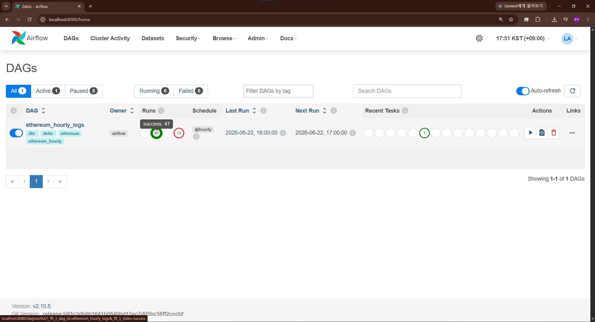
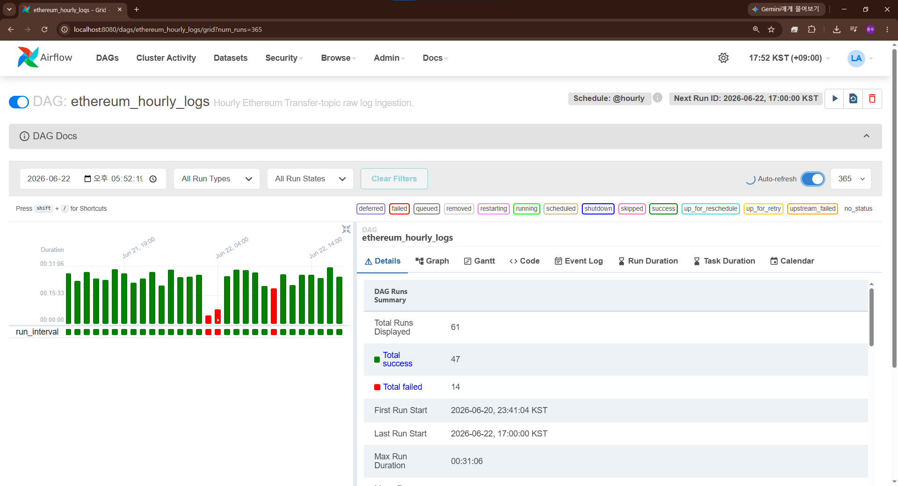
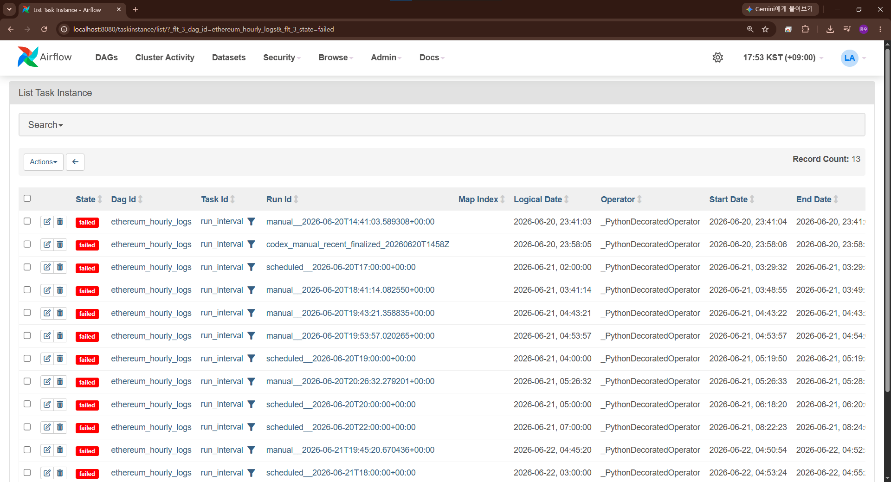
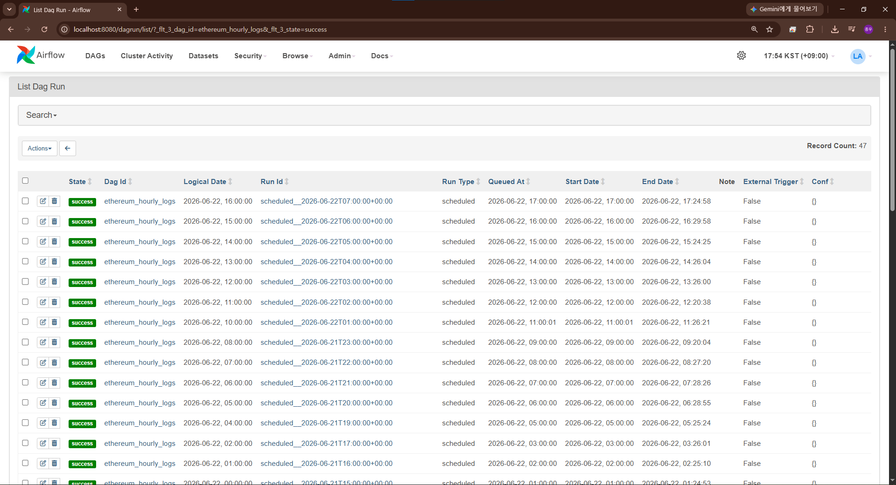
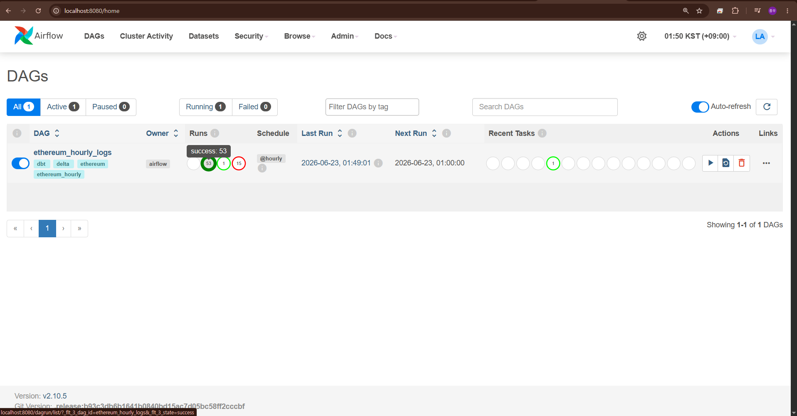

# 05. Validation Evidence

> 상태: 실행 증거 문서
> 기준: 성공/실패/검증되지 않은 항목을 분리해 기록.

검증 일시: 2026-06-19 KST 작업 세션, 2026-06-20 KST 구현 세션, 2026-06-20 KST 총괄 제출 검증 세션, 2026-06-21 KST collection scope
재검증 세션, 2026-06-22 KST dbt dependency expansion, notebook, Airflow UI screenshot, submission boundary 검증 세션.

## 2026-06-22 Refactoring validation

목표: Python 책임 분리, dbt SQL explicit projection, 문서 정합성 갱신이 기존 과제 요구사항을 훼손하지 않는지 확인합니다.

| Command | Result |
|---|---|
| `python -m compileall src tests airflow\dags` | 통과 |
| `python -m pytest tests\test_dbt_contracts.py tests\test_pipeline_idempotency.py tests\test_rpc_retry.py -q` | BLOCKED: 호스트 Python 3.13에 `pytest` 미설치 |
| `docker compose -f docker-compose.yaml -f .devcontainer/docker-compose.devcontainer.yaml config --quiet` | exit 0 |
| `docker compose -f docker-compose.yaml -f .devcontainer/docker-compose.devcontainer.yaml run --rm --no-deps workspace-dev ruff check src tests airflow dbt` | 최초 import 정렬 오류 1건 발견 |
| `docker compose -f docker-compose.yaml -f .devcontainer/docker-compose.devcontainer.yaml run --rm --no-deps workspace-dev ruff check --fix src tests airflow dbt` | import 정렬 1건 수정 |
| `docker compose -f docker-compose.yaml -f .devcontainer/docker-compose.devcontainer.yaml run --rm --no-deps workspace-dev ruff check src tests airflow dbt` | `All checks passed!` |
| `docker compose -f docker-compose.yaml -f .devcontainer/docker-compose.devcontainer.yaml run --rm --no-deps workspace-dev python -m pytest tests/test_dbt_contracts.py tests/test_pipeline_idempotency.py tests/test_rpc_retry.py -q` | `12 passed` |
| `docker compose -f docker-compose.yaml -f .devcontainer/docker-compose.devcontainer.yaml run --rm --no-deps workspace-dev python scripts/create_dbt_validation_fixture.py --root /workspace/data/tmp/dbt_validation/refactor_sql` | `{'inserted': 2, 'rows': 2}` |
| `docker compose -f docker-compose.yaml -f .devcontainer/docker-compose.devcontainer.yaml run --rm --no-deps -e DELTA_LOGS_PATH=/workspace/data/tmp/dbt_validation/refactor_sql/ethereum_logs -e DUCKDB_PATH=/workspace/data/tmp/dbt_validation/refactor_sql/ethereum_analytics.duckdb -e DUCKDB_EXTENSION_DIR=/workspace/data/duckdb_extensions workspace-dev dbt build --project-dir dbt --profiles-dir dbt --select tag:ethereum_hourly --vars '{"window_start": "2024-01-01T00:00:00Z", "window_end": "2024-01-01T01:00:00Z"}' --no-partial-parse` | `PASS=43 WARN=0 ERROR=0 SKIP=0 NO-OP=0 TOTAL=43` |
| `docker compose -f docker-compose.yaml -f .devcontainer/docker-compose.devcontainer.yaml run --rm --no-deps workspace-dev python -m pytest -q` | `49 passed` |
| `docker compose -f docker-compose.yaml -f .devcontainer/docker-compose.devcontainer.yaml run --rm --no-deps workspace-dev python scripts/create_dbt_validation_fixture.py --root /workspace/data/tmp/dbt_validation/final_refactor` | `{'inserted': 2, 'rows': 2}` |
| `docker compose -f docker-compose.yaml -f .devcontainer/docker-compose.devcontainer.yaml run --rm --no-deps -e DELTA_LOGS_PATH=/workspace/data/tmp/dbt_validation/final_refactor/ethereum_logs -e DUCKDB_PATH=/workspace/data/tmp/dbt_validation/final_refactor/ethereum_analytics.duckdb -e DUCKDB_EXTENSION_DIR=/workspace/data/duckdb_extensions workspace-dev dbt build --project-dir dbt --profiles-dir dbt --select tag:ethereum_hourly --vars '{"window_start": "2024-01-01T00:00:00Z", "window_end": "2024-01-01T01:00:00Z"}' --no-partial-parse` | `PASS=43 WARN=0 ERROR=0 SKIP=0 NO-OP=0 TOTAL=43` |
| `docker compose -f docker-compose.yaml -f .devcontainer/docker-compose.devcontainer.yaml run --rm --no-deps workspace-dev python scripts/create_dbt_validation_fixture.py --root /workspace/data/tmp/dbt_validation/origin_matrix_check` | `{'inserted': 2, 'rows': 2}` |
| `docker compose -f docker-compose.yaml -f .devcontainer/docker-compose.devcontainer.yaml run --rm --no-deps -e DELTA_LOGS_PATH=/workspace/data/tmp/dbt_validation/origin_matrix_check/ethereum_logs -e DUCKDB_PATH=/workspace/data/tmp/dbt_validation/origin_matrix_check/ethereum_analytics.duckdb -e DUCKDB_EXTENSION_DIR=/workspace/data/duckdb_extensions workspace-dev dbt build --project-dir dbt --profiles-dir dbt --select tag:ethereum_hourly --vars '{"window_start": "2024-01-01T00:00:00Z", "window_end": "2024-01-01T01:00:00Z"}' --no-partial-parse` | `PASS=43 WARN=0 ERROR=0 SKIP=0 NO-OP=0 TOTAL=43` |
| Airflow DagBag import with `/opt/airflow/python` | `import_errors={}`, `dag_ids=['ethereum_hourly_logs']`, `schedule='@hourly'`, `task_ids=['run_interval']` |
| `dbt ls --project-dir dbt --profiles-dir dbt --select tag:ethereum_hourly --output name --no-partial-parse` | `Found 4 models, 39 data tests, 1 source, 486 macros`; `tether_treasury_flow_quality_summary` 포함 |
| `dbt ls --project-dir dbt --profiles-dir dbt --select erc20_amount_numeric_status_integrity --resource-type test --output json --no-partial-parse` | singular test가 `model.ethereum_analytics.erc20_transfers` 의존성을 가짐 |
| Markdown local link check | `markdown local links ok` |
| secret-like token scan | match가 없음 |
| `git diff --check` | exit 0. 줄끝 변환 경고만 출력 |

이번 검증에서 확인한 항목은 다음과 같습니다.

| 항목 | 상태 | 근거 |
|---|---|---|
| dbt SQL explicit projection | VERIFIED | `tests/test_dbt_contracts.py`가 `dbt/models`, `dbt/tests`의 `select *`를 금지함 |
| dbt fixture build | VERIFIED | `PASS=43 WARN=0 ERROR=0 SKIP=0 NO-OP=0 TOTAL=43` |
| requirement origin matrix | VERIFIED | `docs/09_requirement_traceability_matrix.md`에 `ASSIGNMENT_DIRECT`, `DERIVED_CORE`, `RELEASE`, `BONUS`, `OPTIONAL` origin을 분리함 |
| Python dbt runner 분리 | VERIFIED | ruff, targeted pytest, compileall 통과 |
| live RPC 1시간 Airflow run | VERIFIED | `airflow/logs/` 기준 successful scheduled run 반환값 33건, latest parsed `row_count_after=6082932`, `dbt.returncode=0` 확인 |

최종 전체 검증은 이 문서의 최신 섹션과 최종 응답의 실행 명령을 함께 기준으로 판단합니다.

## 2026-06-22 Task 1 Bitcoin Velocity design validity scan

목표: 과제 1 문서가 Velocity 정의, 원천 테이블, 계산 정책, 의사 SQL, 더미 예시, 일 단위 배치, Reorg 재처리 요구사항을 빠뜨리지 않았는지 별도로 확인합니다.

검증 명령은 `docs/task_01_bitcoin_velocity/` 하위 Markdown을 읽고 요구사항별 핵심 용어와 구조를 확인하는 정적 스캔입니다. 실제 Bitcoin 원천 DB 또는 production SQL 실행은 수행하지 않았습니다.

```text
Velocity formula: PASS
Raw tables: PASS
Volume policy: PASS
Supply policy: PASS
SQL pseudocode: PASS
Dummy data: PASS
Daily batch: PASS
Reorg: PASS
```

| 항목 | 상태 | 근거 | 한계 |
|---|---|---|---|
| 과제 1 설계 요구사항 포괄성 | VERIFIED | 문서 스캔 결과 8개 축 PASS | 설계 문서와 의사 SQL 정합성 검증임 |
| Bitcoin production pipeline 실행 | NOT VERIFIED | 실행 가능한 Bitcoin ETL 코드를 구현하지 않음 | 과제 1 범위를 설계 산출물로 유지함 |

## 2026-06-22 Checklist and metadata recheck

목표: 남아 있는 미체크 항목이 실제 구현되지 않았거나 검증되지 않은 범위인지 확인하고, 이미 검증된 항목은 Airflow 로그와 storage metadata 근거에 연결합니다.

과제 PDF 요구사항 확인:

```text
과제 PDF 직접 요구사항 확인 완료
```

따라서 검증 상태는 PDF 직접 요구사항, README, 구현 코드, SQL, Airflow 로그를 서로 대조한 결과를 기준으로 기록했습니다.

Airflow task log 재확인 결과:

```text
latest_successful_scheduled: PASS
latest_raw_log_count: PASS
latest_inserted_row_count: PASS
latest_row_count_after: PASS
latest_dbt_returncode: PASS
log_files=162
```

`scheduled__2026-06-22T08:00:00+00:00` run은 attempt 1, 2에서 retry 상태가 기록되었고 attempt 3에서 success로 종료되었습니다.
이 때문에 retry 설정과 재실행 경로가 실제 Airflow log에 남아 있습니다.

Storage metadata 재확인 결과:

| 대상 | 확인 결과 | 해석 |
|---|---|---|
| `data/delta/ethereum_logs_v2/_delta_log` | latest notebook recheck 기준 row count `6848937`, duplicate natural key count `0` | local Delta table에 누적 commit history가 존재함 |
| `data/analytics/ethereum_analytics_v2.duckdb` | latest notebook recheck 기준 `erc20_transfers=6079379`, `tether_treasury_flow=2` | dbt downstream 산출물이 로컬 파일로 존재함 |

문서 체크리스트 재확인 결과:

```text
unchecked checklist reason check ok
markdown local links ok
git diff --check -- README.md docs: exit 0, CRLF conversion warning only
```

남겨 둔 미체크 항목은 Private GitHub 최신 반영, canonical reorg replacement, Bronze/Silver 확장 설계, token metadata
dimension처럼 repository 내부 로그와 현재 구현으로 검증할 수 없거나 이번 구현 범위를 벗어난 항목입니다.

## 2026-06-22 Notebook validation refactor

목표: `src/notebooks/`가 과거 smoke output 모음처럼 보이지 않고, 현재 Python source code와 로컬 데이터 산출물의 최신성·흐름을 검증한 보조 증거로 읽히도록 정리합니다.

### 노트북 구조

| 파일 | 목적 | 상태 |
|---|---|---|
| `src/notebooks/00_notebook_validation_index.ipynb` | 노트북 실행 순서와 검증 범위 안내 | 문서형 index |
| `src/notebooks/01_rpc_provider_connection_smoke_test.ipynb` | `PipelineSettings`, `EthereumJsonRpcClient` 기준 provider 연결 smoke | 외부 RPC credential 없으면 BLOCKED |
| `src/notebooks/02_eth_getlogs_transfer_sample_validation.ipynb` | `eth_getLogs` Transfer sample과 decoder 확인 | 외부 RPC credential 없으면 BLOCKED |
| `src/notebooks/03_fixture_etl_replay_idempotency_validation.ipynb` | fixture → normalizer → decode → Delta insert-if-not-exists 재실행 검증 | 실행 완료 |
| `src/notebooks/04_accumulated_pipeline_data_freshness_validation.ipynb` | Delta/DuckDB 후보 인벤토리, 최신 v2 pair 선택, DB 추출 DataFrame, 시간대별 적재 추이, freshness, hourly gap 확인 | 실행 완료, PARTIALLY VERIFIED |

과거 `_task_02_04_validate_accumulated_pipeline_data_v1.ipynb` ~ `v3.ipynb` 중복 파일은 삭제했습니다.
현재 활성 노트북은 번호 prefix와 목적 중심 이름으로만 유지합니다.

### 실행 증거

| Command | Result |
|---|---|
| `docker compose ... workspace-dev python -c "import duckdb, pyarrow, deltalake, pandas"` | notebook 04 runtime core dependency import 성공 |
| `nbclient` execution of `src/notebooks/03_fixture_etl_replay_idempotency_validation.ipynb` in `workspace-dev` | output 저장 완료, error가 없음 |
| custom code-cell execution of `src/notebooks/04_accumulated_pipeline_data_freshness_validation.ipynb` in `workspace-dev` | `EXECUTION_OK`, final status `PARTIALLY VERIFIED` |
| Notebook JSON parse for `src/notebooks/*.ipynb` | 5개 파일 parse 성공, saved error output이 없음 |

03번 노트북의 핵심 출력:

```text
raw_log_count=2
unique_natural_key_count=1
normalized_log_count=2
invalid_log_count=0
decoded_transfer_count_after_key_dedupe=1
fixture transfer expectation matched
first_inserted_row_count=1
second_inserted_row_count=0
row_count_after_second_write=1
duplicate_natural_key_count=0
```

04번 노트북의 핵심 판정:

```text
selected_pair=latest_v2_local
raw_row_count=6848937
raw_duplicate_key_count=0
raw_schema_current=True
dbt_downstream_core_ok=True
final_status=PARTIALLY VERIFIED
```

해석: notebook 04는 기본 `data/delta/ethereum_logs` 대신 최신 schema와 downstream row count가 확인되는
`data/delta/ethereum_logs_v2`, `data/analytics/ethereum_analytics_v2.duckdb` pair를 선택합니다.

raw Delta schema와 중복 key는 통과했지만, 2026-06-22 11:00 UTC 다음 interval이 13:00 UTC라 12:00 UTC hourly gap이 있습니다.

또한, DuckDB `main.ethereum_logs` staging view는 `/opt/airflow/data/delta/ethereum_logs_v2` 절대경로를 저장해 `workspace-dev`의 `/workspace` mount에서는 query error가 발생합니다.

따라서, 누적 로컬 산출물은 현재 code contract 기준에서도 `VERIFIED`가 아니라 `PARTIALLY VERIFIED`로 기록합니다.

fixture 기반 dbt build는 최신 schema로 별도 검증되어 있으며, 실제 accumulated local data를 fixture로 덮어쓰지 않았습니다.

### 검증하지 않았습니다 또는 차단

| 항목 | 상태 | 이유 |
|---|---|---|
| 01/02 노트북 live RPC 실행 | BLOCKED | 실제 `ETH_RPC_URL`, provider 권한, 비용/rate limit 영향이 필요 |
| 2026-06-22 12:00 UTC hourly gap 원인 확인 | PARTIALLY VERIFIED | notebook 04가 gap 위치를 표시하지만, 해당 interval의 Airflow 재실행 또는 backfill은 이번 검증에서 수행하지 않음 |
| DuckDB staging view 절대경로 이식성 | PARTIALLY VERIFIED | downstream materialized tables는 조회되지만 `main.ethereum_logs` view는 `/opt/airflow/...` 경로에 묶여 있어 `workspace-dev`에서 깨짐 |
| Airflow scheduler/UI 기반 notebook 재현 | BLOCKED | notebook은 local validation aid이며 Airflow runtime 증거가 아님 |

## 2026-06-22 Airflow UI screenshot evidence

목표: `data/imgs/` 하위 screenshot을 분석하여 Airflow UI에서 관측된 실행 이력을 문서 증거로 연결합니다.

이 섹션은 Airflow webserver metadata DB에 남은 UI snapshot을 해석합니다. 화면은 로컬 `localhost:8080` 기준이며, row-level data
correctness, 현재 Git working tree와의 완전한 일치, 외부 RPC provider의 지속 운영 안정성을 단독으로 증명하지 않습니다.

### 이미지 목록과 판독 결과

| 이미지 | 화면 | 관측 내용 | 증거로 볼 수 있는 범위 | 상태 | 한계 |
|---|---|---|---|---|---|
| [`data/imgs/task_02_01_image.png`](../data/imgs/task_02_01_image.png) | Airflow DAGs home | DAG `ethereum_hourly_logs` 1개 표시, `@hourly` schedule, tags `dbt`, `delta`, `ethereum`,<br>`ethereum_hourly`, success 47, failed 14, last run `2026-06-22 16:00`,<br>next run `2026-06-22 17:00`, Airflow version `2.10.5` | DAG가 Airflow UI에 등록되고 hourly schedule과 run history가 표시됨 | PARTIALLY VERIFIED | UI snapshot은 실제 task log와 row-level output을 직접 보여주지 않음 |
| [`data/imgs/task_02_02_image.png`](../data/imgs/task_02_02_image.png) | Airflow DAG grid | `ethereum_hourly_logs` grid에서 displayed runs 61, total success 47, total failed 14,<br>first run start `2026-06-20 23:41:04 KST`, last run start `2026-06-22 17:00:00 KST`,<br>max run duration `00:31:06` | scheduled/manual run 이력과 성공/실패 혼재를 확인함 | PARTIALLY VERIFIED | 실패 원인은 이 화면만으로 확인불가 성공 run이 최신 data contract까지 충족했는지도 별도 검증이 필요 |
| [`data/imgs/task_02_03_image.png`](../data/imgs/task_02_03_image.png) | Airflow failed task instance list | `run_interval` task의 failed state record count 13, manual/scheduled run ID와 logical date가 표시됨 | 실패 이력을 숨기지 않고 재실행·디버깅 대상이 있었음을 확인함 | PARTIALLY VERIFIED | 각 실패의 exception, provider error, retry 결과는 task log 또는 CLI 검증이 필요 |
| [`data/imgs/task_02_04_image.png`](../data/imgs/task_02_04_image.png) | Airflow success DAG run list | success DAG run record count 47, `ethereum_hourly_logs` scheduled run들이 `2026-06-22` 여러 logical date에 성공으로 표시됨 | Airflow UI 기준 성공 run history가 존재함 | PARTIALLY VERIFIED | 성공 run이 최신 repository state의 코드로 실행됐는지, raw/dbt 산출물이 최신 schema인지 이 화면만으로 확정불가 |
| [`data/imgs/task_02_05_image.png`](../data/imgs/task_02_05_image.png) | Airflow DAGs home 최신 스냅샷 | DAG `ethereum_hourly_logs`가 active 상태이며 `@hourly` schedule로 동작함. UI 집계상 success 53, failed 15. last run `2026-06-23 00:00:00 KST`, next run `2026-06-23 01:00:00 KST` 표시 | canonical DAG 등록, 활성화 상태, hourly scheduling, 누적 run history의 최신 UI 관측값 | PARTIALLY VERIFIED | UI 집계만으로 각 성공 run의 `dbt.returncode=0`, raw Delta row-level correctness, 모든 실패 원인을 단독으로 증명하지 않음 |

### Screenshot preview



> **Airflow DAG 등록 및 스케줄 상태**  
> `ethereum_hourly_logs` DAG의 활성 상태, `@hourly` 스케줄, 태그, run 집계, 최근 및 다음 실행 시각을 보여줌.



> **Airflow DAG Grid 실행 이력 및 run 집계**  
> 시간축 기준 실행 기간, task duration, 성공·실패 run 분포와 전체 집계를 보여줌.



> **Airflow Failed Task Instance 이력**  
> 실패한 `run_interval` task instance와 해당 run 식별자, logical date를 보여줌. 개별 예외 원인은 task log에서 별도 확인함.



> **Airflow Successful DAG Run 이력**  
> 성공 처리된 `ethereum_hourly_logs` DAG run 목록과 scheduled execution 이력을 보여줌.



> **제출 이후 최신 Airflow DAG 상태 보조 스냅샷**  
> 제출 시점의 직접 증거와 분리된 후속 운영 화면임. 최신 DAG 활성 상태, `@hourly` 스케줄, 누적 run 집계를 참고용으로 제시함.

### 판정

| 항목 | 상태 | 근거 |
|---|---|---|
| Airflow UI DAG registration | VERIFIED | `task_02_05_image.png`에서 active DAG `ethereum_hourly_logs`, `@hourly` schedule, tags, next run이 확인됨 |
| Airflow run history | VERIFIED | 최신 UI snapshot에서 success 53, failed 15가 확인됨. 기존 `task_02_01`~`04`는 이전 시점의 historical UI evidence로 유지함 |
| Airflow scheduled/manual task-log success | VERIFIED | UI snapshot과 별도로 Airflow task log parser에서 successful scheduled run 33건, successful manual run 15건, latest scheduled `dbt.returncode=0`을 확인함 |
| Failure history transparency | PARTIALLY VERIFIED | 최신 UI에서 failed 15가 표시되고 기존 `task_02_03_image.png`에 failed task instance 목록이 남아 있음. 개별 실패 원인은 task log 또는 CLI 판독이 필요함 |
| Screenshot-only data contract correctness | NOT VERIFIED | screenshot은 UI metadata 증거임. Delta natural-key duplicate, dbt build, task payload는 별도 task log·fixture·storage inspection으로 검증함 |

## 2026-06-22 Airflow task log and storage evidence

목표: Airflow UI screenshot을 task log, Delta Lake, DuckDB 산출물과 대조하여 실제 외부 RPC Provider 기반 scheduled 수집 여부를 확인합니다.

이 검증은 로컬 Docker Airflow 실행 이력 기준입니다. 실제 endpoint, credential, provider URL은 출력하거나 문서화하지 않았습니다.
또한 provider SLA, full-history backfill, production monitoring까지 검증했다는 의미는 아닙니다.

### 최신 원천 로그 재확인

2026-06-22 KST 문서 최신화 시점에 Airflow 원천 로그와 로컬 Delta/DuckDB 산출물을 다시 읽어 기존 `07:00` 기준값을 `08:00` 기준값으로 갱신했습니다.

| 검증 대상 | 재확인 결과 |
|---|---|
| Airflow scheduled task log parser | `count=33`, first `scheduled__2026-06-20T21:00:00+00:00`,<br>latest `scheduled__2026-06-22T08:00:00+00:00`, `raw_sum=5411781`, `inserted_sum=5411781` |
| Latest Airflow task payload | `from_block=25371803`, `to_block=25372102`, `raw_log_count=169451`,<br>`inserted_row_count=169451`, `row_count_after=6082932`, `dbt.returncode=0` |
| `scripts/inspect_outputs.py` direct inspection | latest recheck: `delta_row_count=6848937`, `delta_duplicate_natural_key_count=0`,<br>`erc20_transfers_row_count=6079379`, `tether_treasury_flow_row_count=2` |
| DeltaTable direct metadata | latest notebook recheck: `row_count=6848937`, latest event timestamp `2026-06-22T14:59:59Z` |
| DuckDB downstream relation count | latest recheck: `erc20_transfers=6079379`, `tether_treasury_flow=2`, `tether_treasury_flow_quality_summary=1` |

### Airflow task log 판독 결과

`airflow/logs/dag_id=ethereum_hourly_logs` 하위 task log를 파싱했습니다.

```text
successful_scheduled_runs_with_return=33
successful_manual_runs_with_return=15
first_successful_scheduled=scheduled__2026-06-20T21:00:00+00:00
latest_successful_scheduled=scheduled__2026-06-22T08:00:00+00:00
scheduled_raw_log_count_sum=5411781
scheduled_inserted_row_count_sum=5411781
```

최신 successful scheduled run 반환값:

```text
mode=data_interval
from_block=25371803
to_block=25372102
raw_log_count=169451
normalized_log_count=169451
invalid_log_count=0
inserted_row_count=169451
duplicate_skipped_count=0
row_count_after=6082932
dbt.returncode=0
window_start=2026-06-22T08:00:00Z
window_end=2026-06-22T09:00:00Z
```

실패 이력도 함께 존재합니다. `BlockRangeError`, Delta schema mismatch, dbt dependency 오류가 과거 로그에 남아 있으며, 이는 실패를 숨기지 않고 재시도와 수정 이력을 보존한 증거로 해석합니다.

### Delta Lake와 DuckDB 산출물 확인

Docker `workspace-dev` 컨테이너의 `/opt/project/python`으로 로컬 산출물을 읽었습니다.

```text
data/delta/ethereum_logs_v2
row_count=6848937
duplicate_natural_key_count=0
latest_event_timestamp_utc=2026-06-22T14:59:59Z
latest_ingested_at_utc=2026-06-22T15:25:05.500466Z
hourly_interval_count=42
hourly_gap=2026-06-22T11:00:00Z -> 2026-06-22T13:00:00Z
schema_fields=[
  chain_id, block_number, block_hash, transaction_hash, transaction_index,
  log_index, contract_address, topic0, topic1, topic2, topic3, data_raw,
  data_uint256_decimal_text, data_uint256_decode_status, removed,
  block_timestamp_utc, block_date_utc, interval_start_utc,
  interval_end_utc, ingested_at_utc
]
```

```text
data/analytics/ethereum_analytics_v2.duckdb
erc20_transfers=6079379
tether_treasury_flow=2
tether_treasury_flow_quality_summary=1
```

대조 결과, v2 Delta와 DuckDB downstream relation은 최신 direct inspection에서 서로 연결됩니다.
다만 이 최신 direct inspection은 Airflow task log parser를 새로 갱신한 값이 아니라, 로컬 산출물을 직접 읽은 값입니다.
DuckDB에는 downstream relation이 생성되어 있으며, `erc20_transfers` row count도 수집 규모와 연결됩니다.

기본 `data/delta/ethereum_logs` 경로에는 구 schema 1건이 남아 있습니다.
notebook 04는 이 기본 경로를 stale candidate로 표시하고, 최신 v2 pair를 선택해 DB 추출과 시계열 gap을 확인합니다.
누적 Airflow 실행 증거는 `ethereum_logs_v2`와 `ethereum_analytics_v2.duckdb` 경로를 기준으로 해석합니다.

### 판정

| 항목 | 상태 | 근거 | 한계 |
|---|---|---|---|
| 외부 RPC Provider 기반 1시간 scheduled 수집 | VERIFIED | Airflow successful scheduled 반환값 33건, 최신 run `raw_log_count=169451`, `dbt.returncode=0` | 로컬 Docker 실행 이력 기준 |
| Delta Lake 적재 누적성 | VERIFIED | `ethereum_logs_v2` direct row count `6848937`, duplicate key `0` | 기본 `ethereum_logs` 경로는 구 schema. 2026-06-22 12:00 UTC hourly gap 원인 확인은 남아 있음 |
| dbt downstream 산출 | VERIFIED | `ethereum_analytics_v2.duckdb`의 `erc20_transfers=6079379`, `tether_treasury_flow=2`, `quality_summary=1` | DuckDB view `ethereum_logs`는 `/opt/airflow/...` 절대 경로에 묶여 있어 컨테이너별 mount path 확인이 필요 |
| Production-grade 지속 운영 안정성 | NOT VERIFIED | 로컬 Docker의 성공·실패 이력과 재시도 후 성공 run만 확인함 | provider SLA, alerting, secret rotation, full-history backfill은 검증하지 않음 |

## Bonus: DAG modification-free dbt dependency expansion

목표: 신규 dbt 모델 추가 시 Airflow DAG 파일을 수정하지 않고도
`tag:ethereum_hourly` selector와 dbt `ref()` dependency graph만으로 실행 대상과
실행 순서가 자동 반영되는지 검증했습니다.

### 확인된 구조

- Airflow active DAG: `airflow/dags/ethereum_hourly_logs.py`
- Airflow DAG 역할: `run_interval()` callable 호출. 개별 dbt 모델명은 DAG 파일에 없습니다.
- 실제 dbt 실행 경계: `src/cryptoquant_pipeline/dbt_runner.py`의 `run_dbt_build()`.
- dbt command selector: `dbt build --select tag:ethereum_hourly --vars {"window_start": ..., "window_end": ...}`.
- dbt tag 적용: `dbt/dbt_project.yml`의 `models.ethereum_analytics.+tags: ["ethereum_hourly"]`.
- 신규 모델: `dbt/models/gold/tether_treasury_flow_quality_summary.sql`.
- 신규 모델 dependency: `{{ ref('tether_treasury_flow') }}`.
- hidden/ref 의존성 명시: model/test SQL 상단의 `-- depends_on: {{ ref(...) }}` 주석으로 dbt parser가 graph를 명확히 해석하도록 합니다.

새 모델은 dummy model이 아니라 `tether_treasury_flow`의 현재 Airflow/dbt window 결과를
1행으로 요약하는 품질 view다. `flow_row_count`, `transfer_count`,
`direction_count`, inflow/outflow raw/USDT 합계를 노출합니다.

### Airflow DAG 무수정 검증

이 검증 세션에서 Airflow DAG 파일은 수정하지 않았습니다. active DAG 파일 해시는 시작과
종료 시점 모두 동일했습니다.

```text
Get-FileHash airflow\dags\ethereum_hourly_logs.py -Algorithm SHA256
SHA256 A1185004E975A587291DE5EF8D48B1C8F77A5948EC17C5E3AAA3CC2726B9530C
```

작업트리에는 검증 시작 전부터 아래 Airflow 상태가 있었고, 검증 종료 시에도 동일했습니다.
이번 Bonus 검증에서는 Airflow 파일을 patch하지 않았습니다.

```text
git status --short airflow/dags
 D airflow/dags/ethereum_logs_pipeline.py
?? airflow/dags/ethereum_hourly_logs.py
```

### 실행 증거

Fixture Delta 생성:

```powershell
docker compose -f docker-compose.yaml -f .devcontainer/docker-compose.devcontainer.yaml run --rm --no-deps workspace-dev python scripts/create_dbt_validation_fixture.py --root /workspace/data/tmp/dbt_validation/legacy_cleanup
```

결과:

```text
{'inserted': 2, 'rows': 2}
```

Selector 포함 검증:

```powershell
docker compose -f docker-compose.yaml -f .devcontainer/docker-compose.devcontainer.yaml run --rm --no-deps workspace-dev bash -lc "DELTA_LOGS_PATH=/workspace/data/tmp/dbt_validation/legacy_cleanup/ethereum_logs DUCKDB_PATH=/workspace/data/tmp/dbt_validation/legacy_cleanup/ethereum_analytics.duckdb DUCKDB_EXTENSION_DIR=/workspace/data/duckdb_extensions dbt ls --project-dir dbt --profiles-dir dbt --select tag:ethereum_hourly --output name --no-partial-parse"
```

핵심 출력:

```text
Found 4 models, 39 data tests, 1 source, 486 macros
erc20_transfers
ethereum_logs
tether_treasury_flow
tether_treasury_flow_quality_summary
...
not_null_tether_treasury_flow_quality_summary_window_start_utc
```

Dependency graph 검증:

```powershell
docker compose -f docker-compose.yaml -f .devcontainer/docker-compose.devcontainer.yaml run --rm --no-deps workspace-dev bash -lc "DELTA_LOGS_PATH=/workspace/data/tmp/dbt_validation/legacy_cleanup/ethereum_logs DUCKDB_PATH=/workspace/data/tmp/dbt_validation/legacy_cleanup/ethereum_analytics.duckdb DUCKDB_EXTENSION_DIR=/workspace/data/duckdb_extensions dbt ls --project-dir dbt --profiles-dir dbt --select tether_treasury_flow_quality_summary --output json --no-partial-parse"
```

핵심 출력:

```json
{
  "name": "tether_treasury_flow_quality_summary",
  "resource_type": "model",
  "config": {"tags": ["ethereum_hourly"], "materialized": "view"},
  "depends_on": {"nodes": ["model.ethereum_analytics.tether_treasury_flow"]}
}
```

Build 검증:

```powershell
docker compose -f docker-compose.yaml -f .devcontainer/docker-compose.devcontainer.yaml run --rm --no-deps workspace-dev bash -lc 'DELTA_LOGS_PATH=/workspace/data/tmp/dbt_validation/legacy_cleanup/ethereum_logs DUCKDB_PATH=/workspace/data/tmp/dbt_validation/legacy_cleanup/ethereum_analytics.duckdb DUCKDB_EXTENSION_DIR=/workspace/data/duckdb_extensions dbt build --project-dir dbt --profiles-dir dbt --select tag:ethereum_hourly --vars "{window_start: 2024-01-01T00:00:00Z, window_end: 2024-01-01T01:00:00Z}" --no-partial-parse'
```

핵심 실행 순서와 결과:

```text
1 of 43 OK created sql view model main.ethereum_logs
9 of 43 OK created sql incremental model main.erc20_transfers
22 of 43 OK created sql incremental model main.tether_treasury_flow
34 of 43 OK created sql view model main.tether_treasury_flow_quality_summary
Completed successfully
Done. PASS=43 WARN=0 ERROR=0 SKIP=0 NO-OP=0 TOTAL=43
```

결과 relation 확인:

```powershell
docker compose -f docker-compose.yaml -f .devcontainer/docker-compose.devcontainer.yaml run --rm --no-deps workspace-dev python -c "..."
```

결과:

```text
{'ethereum_logs': 2, 'erc20_transfers': 2, 'tether_treasury_flow': 1, 'tether_treasury_flow_quality_summary': 1}
[(1, 1, 1, Decimal('0'), Decimal('1000000'))]
```

### 판정

| 항목 | 상태 | 근거 |
|---|---|---|
| 구현 | VERIFIED | 신규 quality summary dbt model과 schema tests 추가 |
| dbt graph 자동 반영 | VERIFIED | `dbt ls --select tag:ethereum_hourly`에 신규 모델 포함, manifest `depends_on`이 `tether_treasury_flow`를 가리킴 |
| Airflow 무수정 조건 | VERIFIED | active DAG SHA256 시작/종료가 동일하며, 이번 세션에서 Airflow 파일 patch는 없음 |
| Airflow end-to-end 실행 | VERIFIED | `airflow/logs/` task 반환값, `data/delta/ethereum_logs_v2`,<br>`data/analytics/ethereum_analytics_v2.duckdb`를 대조해 외부 RPC 수집, Delta 적재, dbt build 성공을 확인함 |
| Airflow UI run history | PARTIALLY VERIFIED | `data/imgs/` screenshot에서 DAG 등록, `@hourly`, success/failed history를 확인함 UI screenshot 단독으로는 row-level correctness 증거가 아님 |
| 가산점 제출 근거 완결성 | VERIFIED | Airflow runtime trigger log 없이도 DAG selector 구조와 dbt graph/build/result evidence로 DAG 수정 없는 dbt dependency expansion을 검증함 |

Airflow end-to-end 증거 범위: task log에서 외부 RPC block range, raw log count,
Delta inserted row count, dbt return code를 확인했고, 저장소의 Delta/DuckDB 산출물과
row count를 대조했습니다. Airflow UI screenshot은 run history 보조 증거로만 사용합니다.
production-grade 무중단 운영과 provider SLA는 별도 검증 대상입니다.

## 2026-06-22 Legacy cleanup verification

레거시 삭제와 문서/경로 교정 후 현재 repository 상태에서 재실행한 검증입니다.

| Command | Result |
|---|---|
| `docker compose -f docker-compose.yaml -f .devcontainer/docker-compose.devcontainer.yaml config --quiet` | exit 0 |
| `docker compose -f docker-compose.yaml -f .devcontainer/docker-compose.devcontainer.yaml run --rm --no-deps workspace-dev python -m compileall src tests scripts airflow/dags` | exit 0 |
| `docker compose -f docker-compose.yaml -f .devcontainer/docker-compose.devcontainer.yaml run --rm --no-deps workspace-dev ruff check .` | `All checks passed!` |
| `docker compose -f docker-compose.yaml -f .devcontainer/docker-compose.devcontainer.yaml run --rm --no-deps workspace-dev python -m pytest -q` | `49 passed` |
| Markdown local link check | `markdown local links ok` |
| `git diff --check` | exit 0. CRLF 변환 경고만 출력 |
| `docker compose -f docker-compose.yaml -f .devcontainer/docker-compose.devcontainer.yaml run --rm --no-deps workspace-dev python scripts/create_dbt_validation_fixture.py --root /workspace/data/tmp/dbt_validation/legacy_cleanup` | `{'inserted': 2, 'rows': 2}` |
| `dbt parse --project-dir dbt --profiles-dir dbt --no-partial-parse` in `workspace-dev` | exit 0 |
| `dbt ls --project-dir dbt --profiles-dir dbt --select tag:ethereum_hourly --output name --no-partial-parse` in `workspace-dev` | `Found 4 models, 39 data tests, 1 source, 486 macros`; `tether_treasury_flow_quality_summary` 포함 |
| `dbt ls --select tether_treasury_flow_quality_summary --output json --no-partial-parse` in `workspace-dev` | `tags=["ethereum_hourly"]`, `depends_on.nodes=["model.ethereum_analytics.tether_treasury_flow"]` |
| `dbt build --project-dir dbt --profiles-dir dbt --select tag:ethereum_hourly --vars "{window_start: 2024-01-01T00:00:00Z, window_end: 2024-01-01T01:00:00Z}" --no-partial-parse` in `workspace-dev` | `PASS=43 WARN=0 ERROR=0 SKIP=0 NO-OP=0 TOTAL=43` |
| DuckDB relation count query | `{'ethereum_logs': 2, 'erc20_transfers': 2, 'tether_treasury_flow': 1, 'tether_treasury_flow_quality_summary': 1}` |
| Airflow DagBag import with `/opt/airflow/python/bin/python` | `import_error_count=0`, `dag_ids=['ethereum_hourly_logs']`, `schedule='@hourly'`,<br>`max_active_runs=1`, `task_ids=['run_interval']` |

Airflow UI screenshot, task log, Delta/DuckDB 산출물로 scheduler run history와 real RPC
1시간 E2E를 확인했습니다. 다만 이 결과는 로컬 Docker 실행 이력 기준이며, production
Airflow 배포, provider SLA, alerting, full-history backfill은 별도 검증 대상입니다.

## 2026-06-20T18:31Z collection scope 재검증

변경 목적: acceptance 기본 수집 범위를 USDT address-filtered scope가 아니라
`transfer_topic_all_addresses`로 고정하고, Airflow DAG가 `@hourly` schedule을
갖는지 확인했습니다.

| Command | Result |
|---|---|
| `python -m compileall scripts\create_dbt_validation_fixture.py tests\test_dbt_contracts.py src\cryptoquant_pipeline tests\test_collection_scope.py tests\test_rpc_retry.py tests\test_pipeline_idempotency.py airflow\dags\ethereum_hourly_logs.py` | 성공 |
| `docker compose -f docker-compose.yaml -f .devcontainer/docker-compose.devcontainer.yaml run --rm --no-deps workspace-dev ruff check scripts/create_dbt_validation_fixture.py tests/test_dbt_contracts.py tests/test_collection_scope.py tests/test_rpc_retry.py tests/test_pipeline_idempotency.py src/cryptoquant_pipeline/config.py src/cryptoquant_pipeline/log_collector.py src/cryptoquant_pipeline/rpc_client.py airflow/dags/ethereum_hourly_logs.py` | `All checks passed!` |
| `docker compose -f docker-compose.yaml -f .devcontainer/docker-compose.devcontainer.yaml run --rm --no-deps workspace-dev python -m pytest tests/test_collection_scope.py tests/test_rpc_retry.py tests/test_pipeline_idempotency.py tests/test_dbt_contracts.py -q` | `14 passed` |
| `docker compose -f docker-compose.yaml -f .devcontainer/docker-compose.devcontainer.yaml run --rm --no-deps workspace-dev python -m pytest -q` | `57 passed` |
| `docker compose -f docker-compose.yaml -f .devcontainer/docker-compose.devcontainer.yaml run --rm --no-deps workspace-dev ruff check .` | `All checks passed!` |
| `docker compose -f docker-compose.yaml -f .devcontainer/docker-compose.devcontainer.yaml run --rm --no-deps workspace-dev bash -lc "PYTHONPATH=/workspace/src /opt/airflow/python/bin/python - <<'PY' ..."` | `dag_count=1`, `import_errors={}`, `schedule='@hourly'` |
| `docker compose -f docker-compose.yaml -f .devcontainer/docker-compose.devcontainer.yaml run --rm --no-deps workspace-dev python scripts/create_dbt_validation_fixture.py --root /workspace/data/tmp/dbt_validation/current` | `{'inserted': 2, 'rows': 2}` |
| `docker compose -f docker-compose.yaml -f .devcontainer/docker-compose.devcontainer.yaml run --rm --no-deps -e DELTA_LOGS_PATH=/workspace/data/tmp/dbt_validation/current/ethereum_logs -e DUCKDB_PATH=/workspace/data/tmp/dbt_validation/current/ethereum_analytics.duckdb -e DUCKDB_EXTENSION_DIR=/workspace/data/duckdb_extensions workspace-dev dbt build --project-dir dbt --profiles-dir dbt --select tag:ethereum_hourly --vars '{"window_start": "2024-01-01T00:00:00Z", "window_end": "2024-01-01T01:00:00Z"}'` | `PASS=25 WARN=0 ERROR=0 SKIP=0 NO-OP=0 TOTAL=25` |
| `docker compose -f docker-compose.yaml -f .devcontainer/docker-compose.devcontainer.yaml run --rm --no-deps -e DUCKDB_PATH=/workspace/data/tmp/dbt_validation/current/ethereum_analytics.duckdb workspace-dev python -c "...count main.erc20_transfers and main.tether_treasury_flow..."` | `{'erc20_transfers': 2, 'tether_treasury_flow': 1, 'non_usdt_amount_usdt_not_null': 0}` |

검증하지 않았습니다 당시 항목: 이 2026-06-20 세션에서는 실제 provider에서 `transfer_topic_all_addresses` scope의 1시간 live E2E를 완료하지 못했습니다.

이후 2026-06-22 Airflow task log와 `ethereum_logs_v2` 산출물로 1시간 scheduled 수집 이력은 확인했습니다. 

PHASE 0/PHASE 5 provider qualification fingerprint 비교와 staging-to-canonical publication manifest는 여전히 구현하지 않았습니다.

## Docker Ubuntu/Python 통합 재검증

2026-06-19 KST에 개발/운영 Docker 이미지를 Ubuntu 24.04/Python 3.12 기준으로 재검증했습니다.

```text
Ubuntu 24.04.4 LTS
/opt/project/python/bin/python
Python 3.12.3
/opt/airflow/python/bin/airflow
Airflow 2.10.5
/opt/project/python/bin/dbt
dbt-core 1.11.11
```

Airflow 2.10.x와 dbt 1.9+는 `protobuf` 요구 범위가 충돌해 단일 Python 실행 경로로 빌드할 수 없었습니다.
따라서 같은 Docker 이미지 안에서 Airflow 실행 경로와 project/dbt 실행 경로를 분리하고, 양쪽 모두 `pip check`를 통과하는지 검증했습니다.

운영 Airflow DAG import 검증:

```text
dag_count=1
import_errors={}
```

2026-06-20 KST 총괄 검증에서 Airflow 전용 Python 경로로 재확인했습니다. 프로젝트 Python에는 Airflow가 설치되지 않는 분리 구조이므로 `/opt/airflow/python/bin/python`을 사용해야 합니다.

```powershell
docker compose -f docker-compose.yaml -f .devcontainer/docker-compose.devcontainer.yaml run --rm --no-deps workspace-dev /opt/airflow/python/bin/python -c "from airflow.models import DagBag; dagbag=DagBag(dag_folder='/workspace/airflow/dags', include_examples=False); print({'import_errors': dagbag.import_errors, 'dag_ids': sorted(dagbag.dags)})"
```

결과:

```text
import_errors={}
dag_ids=['ethereum_hourly_logs']
```

## 성공한 명령

### 의존성 설치

현재 기준 의존성 설치는 호스트 Python이 아니라 Docker 이미지 빌드 단계에서 수행했습니다.

```text
docker compose -f docker-compose.yaml -f .devcontainer/docker-compose.devcontainer.yaml build workspace-dev
```

### 문법 검사

```powershell
docker compose -f docker-compose.yaml -f .devcontainer/docker-compose.devcontainer.yaml run --rm --no-deps workspace-dev python -m compileall src tests airflow/dags scripts
```

결과: 성공.

### Ruff

```powershell
docker compose -f docker-compose.yaml -f .devcontainer/docker-compose.devcontainer.yaml run --rm --no-deps workspace-dev ruff check .
```

결과:

```text
All checks passed!
```

### Pytest

```powershell
docker compose -f docker-compose.yaml -f .devcontainer/docker-compose.devcontainer.yaml run --rm --no-deps workspace-dev python -m pytest -q
```

이전 결과:

```text
18 passed
```

2026-06-20 재검증 결과:

```text
44 passed
```

2026-06-20 KST 총괄 제출 검증에서도 동일하게 `44 passed` 확인.

### Fixture Delta 생성

```text
DeltaWriteResult(... inserted_row_count=1, duplicate_skipped_count=1, row_count_after=1)
```

### dbt build

최초 실패 1: DuckDB 기본 extension directory 권한 문제.

```text
Failed to create directory "C:\Users\<local-user>\.duckdb": 액세스가 거부되었습니다.
```

수정: `DUCKDB_EXTENSION_DIR`와 dbt `config_options.extension_directory`를 프로젝트 내부로 지정.

최초 실패 2: Delta extension 다운로드 네트워크 실패.

```text
Failed to download extension "delta"
```

네트워크 승인 후 다음 실패 확인.

최초 실패 3: DuckDB 1.5.4에 `from_base()` 함수 없습니다.

```text
Scalar Function with name from_base does not exist
```

수정: 13 hex digit 이하 안전 범위만 SQL에서 decimal 변환하는 macro로 변경.

이 시점의 legacy selector는 이후 `tag:ethereum_hourly`로 교체했습니다. 현재 실행
명령은 아래 2026-06-20 이후 검증 블록을 기준으로 합니다.

2026-06-20 새 dbt graph 검증:

```powershell
docker compose -f docker-compose.yaml -f .devcontainer/docker-compose.devcontainer.yaml run --rm --no-deps workspace-dev python scripts/create_dbt_validation_fixture.py --root /workspace/data/tmp/dbt_validation/run2
docker compose -f docker-compose.yaml -f .devcontainer/docker-compose.devcontainer.yaml run --rm --no-deps -e DELTA_LOGS_PATH=/workspace/data/tmp/dbt_validation/run2/ethereum_logs -e DUCKDB_PATH=/workspace/data/tmp/dbt_validation/run2/ethereum_analytics.duckdb -e DUCKDB_EXTENSION_DIR=/workspace/data/duckdb_extensions workspace-dev dbt build --project-dir dbt --profiles-dir dbt --select tag:ethereum_hourly --vars '{"window_start": "2024-01-01T00:00:00Z", "window_end": "2024-01-01T01:00:00Z"}'
```

결과:

```text
PASS=24 WARN=0 ERROR=0 SKIP=0 NO-OP=0 TOTAL=24
```

2026-06-20 KST 총괄 제출 검증에서는 새 `current` fixture를 생성해 동일 graph를 재검증했습니다.

```powershell
docker compose -f docker-compose.yaml -f .devcontainer/docker-compose.devcontainer.yaml run --rm --no-deps workspace-dev python scripts/create_dbt_validation_fixture.py --root /workspace/data/tmp/dbt_validation/current
docker compose -f docker-compose.yaml -f .devcontainer/docker-compose.devcontainer.yaml run --rm --no-deps -e DELTA_LOGS_PATH=/workspace/data/tmp/dbt_validation/current/ethereum_logs -e DUCKDB_PATH=/workspace/data/tmp/dbt_validation/current/ethereum_analytics.duckdb -e DUCKDB_EXTENSION_DIR=/workspace/data/duckdb_extensions workspace-dev dbt build --project-dir dbt --profiles-dir dbt --select tag:ethereum_hourly --vars '{"window_start": "2024-01-01T00:00:00Z", "window_end": "2024-01-01T01:00:00Z"}'
```

결과:

```text
fixture={'inserted': 2, 'rows': 2}
PASS=25 WARN=0 ERROR=0 SKIP=0 NO-OP=0 TOTAL=25
row_counts={'erc20_transfers': 2, 'tether_treasury_flow': 1, 'non_usdt_amount_usdt_not_null': 0}
```

### dbt full refresh 후 재실행

실수로 `--full-refresh`와 일반 build를 병렬 실행했을 때 DuckDB file lock이 발생했습니다.

```text
Cannot open file "...ethereum_analytics.duckdb": 다른 프로세스가 파일을 사용 중
```

수정: dbt 명령은 같은 DuckDB 파일을 쓰므로 순차 실행했습니다.

현재 full-refresh 재검증은 이 세션에서 수행하지 않았습니다. 최신 검증은 fixture 기반
`dbt build --select tag:ethereum_hourly` 결과를 기준으로 합니다.

### Output inspection

```powershell
docker compose -f docker-compose.yaml -f .devcontainer/docker-compose.devcontainer.yaml run --rm --no-deps workspace-dev python scripts/inspect_outputs.py
```

결과:

```text
delta_row_count=1
delta_duplicate_key_count=0
erc20_transfers_row_count=1
tether_treasury_flow_row_count=1
```

## 실패 또는 검증하지 않았습니다

### 2026-06-20 KST 총괄 제출 검증

| Command | Result |
|---|---|
| `docker compose -f docker-compose.yaml -f .devcontainer/docker-compose.devcontainer.yaml config --quiet` | exit 0 |
| `docker compose -f docker-compose.yaml -f .devcontainer/docker-compose.devcontainer.yaml images workspace-dev` | 기존 image 존재 확인 |
| `docker compose -f docker-compose.yaml -f .devcontainer/docker-compose.devcontainer.yaml run --rm --no-deps workspace-dev python --version` | `Python 3.12.3` |
| `docker compose -f docker-compose.yaml -f .devcontainer/docker-compose.devcontainer.yaml run --rm --no-deps workspace-dev airflow version` | `2.10.5` |
| `docker compose -f docker-compose.yaml -f .devcontainer/docker-compose.devcontainer.yaml run --rm --no-deps workspace-dev ruff check .` | `All checks passed!` |
| `docker compose -f docker-compose.yaml -f .devcontainer/docker-compose.devcontainer.yaml run --rm --no-deps workspace-dev python -m pytest -q` | `57 passed` |
| `docker compose -f docker-compose.yaml -f .devcontainer/docker-compose.devcontainer.yaml run --rm --no-deps workspace-dev python scripts/create_dbt_validation_fixture.py --root /workspace/data/tmp/dbt_validation/current` | `{'inserted': 2, 'rows': 2}` |
| `docker compose -f docker-compose.yaml -f .devcontainer/docker-compose.devcontainer.yaml run --rm --no-deps -e DELTA_LOGS_PATH=/workspace/data/tmp/dbt_validation/current/ethereum_logs -e DUCKDB_PATH=/workspace/data/tmp/dbt_validation/current/ethereum_analytics.duckdb -e DUCKDB_EXTENSION_DIR=/workspace/data/duckdb_extensions workspace-dev dbt build --project-dir dbt --profiles-dir dbt --select tag:ethereum_hourly --vars '{"window_start": "2024-01-01T00:00:00Z", "window_end": "2024-01-01T01:00:00Z"}'` | `PASS=25 WARN=0 ERROR=0 SKIP=0 NO-OP=0 TOTAL=25` |
| `git diff --check` | exit 0. 줄끝 변환 경고만 출력 |
| secret-like value scan | 실제 provider URL/key 원문은 확인되지 않음 추가 키워드 검색에서는 `.env.example` placeholder와 문서 설명용 단어만 관측됨 |

### dbt debug

```powershell
docker compose -f docker-compose.yaml -f .devcontainer/docker-compose.devcontainer.yaml run --rm --no-deps workspace-dev dbt debug --project-dir dbt --profiles-dir dbt
```

결과:

```text
profiles.yml file [OK]
dbt_project.yml file [OK]
Connection test: [OK connection ok]
git [ERROR]
```

원인: 과거 호스트 Windows PATH에 `git` 명령이 없었습니다. 현재 컨테이너 이미지에는 `git`을 포함합니다.

### Airflow DAG parse/list

호스트 Python에서는 실행하지 않았습니다. Airflow CLI/runtime은 Ubuntu 24.04 Docker 이미지 안에서만 검증했습니다.

### 실제 RPC

2026-06-20 KST에 `src/.env`의 legacy provider 키 이름(`CHAINSTACK_*`)을 fallback으로 읽어 실제 RPC 일부를 검증했습니다.
endpoint, key, username, password 원문은 출력하지 않았습니다.

성공:

```text
eth_chainId=1
chain_id_ok=True
finalized_block_number=25358628
finalized_block_timestamp_utc=2026-06-20T11:53:59+00:00
```

최신 finalized 10블록 smoke는 당시 USDT address-filtered `eth_getLogs`로 수행했습니다.
현재 acceptance scope는 `transfer_topic_all_addresses`이므로 이 결과 자체는 provider 연결
smoke로만 사용했습니다. 2026-06-22 Airflow task log의 scheduled run 결과가 현재 CORE live E2E
evidence 역할을 합니다:

```text
from_block=25358619
to_block=25358628
block_count=10
raw_log_count=1219
unique_event_key_count=1219
duplicate_event_key_count=0
```

실패:

```text
scripts/run_rpc_smoke_validation.py
-> timestamp lower-bound binary search 중 eth_getBlockByNumber historical lookup에서 HTTP 403
```

해석: 현재 연결된 provider는 최신 finalized 조회와 최신 10블록 log 조회는 허용하지만, binary search가 요구하는 임의 과거 block lookup을 막고 있습니다.
Alchemy Free 등 과거 block lookup을 허용하는 endpoint로 `src/notebooks/01_rpc_provider_connection_smoke_test.ipynb`와
`src/notebooks/02_eth_getlogs_transfer_sample_validation.ipynb`부터 재실행 필요합니다.

## Mock/fixture 검증 범위

- block range boundary, empty interval, future interval, finality buffer.
- adaptive range split와 batch dedup.
- raw normalization lowercasing/null topic.
- Delta idempotency.
- dbt incremental models와 tests.

## 2026-06-19 KST 중간 커밋 전 재검증

아래 검증은 새 dependency 설치나 Docker image rebuild 없이, 이미 존재한 `workspace-dev` image를 사용해 수행했습니다.

| Command | Result |
|---|---|
| `python -m pytest -q` | 호스트 Python 3.13에서 `No module named pytest`로 BLOCKED |
| `python -m compileall src tests airflow/dags scripts` | 성공 |
| `$env:PYTHONPATH='src'; python -c "...PipelineConfig...EthereumIngestionSettings..."` | 성공 |
| `docker compose config` | exit 0. Docker client config 접근 경고가 있음 |
| `docker compose -f docker-compose.yaml -f .devcontainer/docker-compose.devcontainer.yaml images workspace-dev` | 기존 image 존재 확인 |
| `docker compose -f docker-compose.yaml -f .devcontainer/docker-compose.devcontainer.yaml run --rm --no-deps workspace-dev python -m pytest -q` | `18 passed` |
| `docker compose -f docker-compose.yaml -f .devcontainer/docker-compose.devcontainer.yaml run --rm --no-deps workspace-dev ruff check .` | `All checks passed!` |
| `docker compose -f docker-compose.yaml -f .devcontainer/docker-compose.devcontainer.yaml run --rm --no-deps workspace-dev dbt parse --project-dir dbt --profiles-dir dbt --no-partial-parse` | 최초 실행은 `models.ethereum_analytics.tests` unused configuration path warning이 있음 `dbt/dbt_project.yml` 수정 후 재실행 결과 exit 0, 경고가 없음 |

여전히 검증하지 않았습니다:

- timestamp -> block range binary search의 실제 provider end-to-end 검증.
- production Airflow 배포, provider SLA, full-history backfill.
- Docker image rebuild.
- Reorg replacement fixture.
- full `uint256` boundary behavior.
